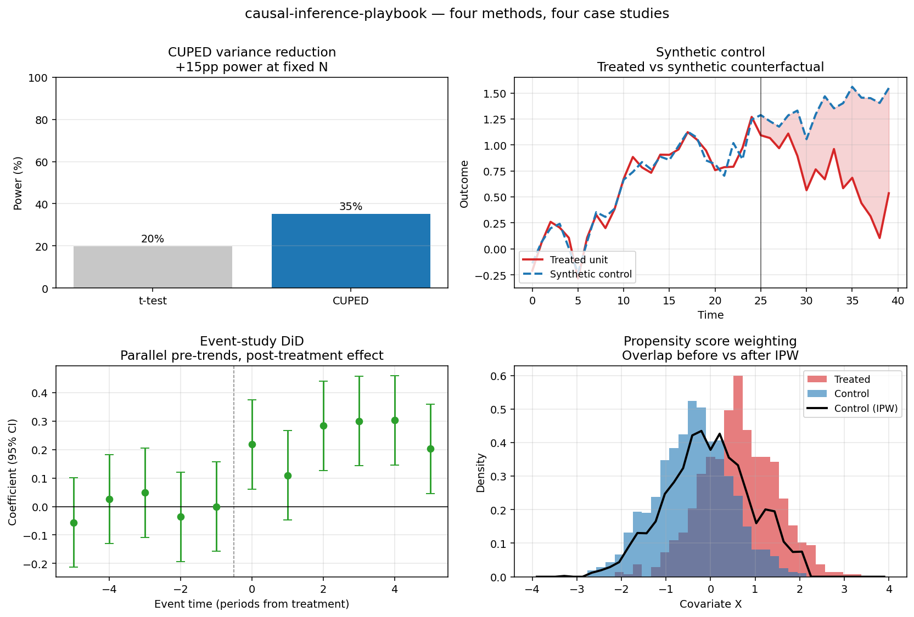

# Causal Inference Playbook

> A hands-on tour of experimentation and causal methods used in senior analytics work — each case study paired with a memo-style writeup.




## Why this repo

A/B tests are only part of the job. Senior analytics work at FAANG-scale companies demands a broader toolkit:

- **Variance reduction** (CUPED, stratification) because 1% MDEs require ruthless efficiency
- **Quasi-experiments** (synthetic control, diff-in-diff) because you can't always randomize
- **Sequential tests** because business stakeholders peek at dashboards
- **Memo-writing** because the analysis is only as good as the decision it drives

Each case study pairs working code with a written writeup.

## Case Studies

| # | Case Study | Method | Status |
|---|-----------|--------|--------|
| 01 | [A/B test with CUPED](case-studies/01-ab-cuped/) | Regression-adjusted variance reduction | ✅ Complete |
| 02 | [Synthetic control](case-studies/02-synthetic-control/) | Abadie weighted donors + placebo inference | ✅ Complete |
| 03 | [Difference-in-differences](case-studies/03-diff-in-diff/) | TWFE + event study + parallel-trends test | ✅ Complete |
| 04 | [Propensity score matching](case-studies/04-propensity-score/) | PSM + IPW + doubly-robust (AIPW) | ✅ Complete |
| 05 | [Sequential testing](case-studies/05-sequential-testing/) | mSPRT + Pocock alpha-spending | ✅ Complete |
| 06 | [Switchback (marketplace)](case-studies/06-switchback/) | Block-level randomization under SUTVA violation | ✅ Complete |

Each case study follows the same skeleton:

```
case-studies/NN-name/
  src/          # implementation + simulator + reproducer
  README.md     # framing, method, results, limitations
```

Shared tests live at `tests/`; CI config at `.github/workflows/`.

## How to run

```bash
python -m venv .venv
.venv\Scripts\activate          # Windows
source .venv/bin/activate       # macOS / Linux
pip install -r requirements.txt
pytest -q
```

Each case study's README documents how to reproduce its analysis.

## References

- Kohavi, Tang, Xu — *Trustworthy Online Controlled Experiments*
- Deng et al. (2013) — *Improving the Sensitivity of Online Controlled Experiments by Utilizing Pre-Experiment Data* (CUPED)
- Abadie, Diamond, Hainmueller (2010) — *Synthetic Control Methods*
- Goodman-Bacon (2021) — *Difference-in-Differences with Variation in Treatment Timing*
- Rosenbaum & Rubin (1983) — *The Central Role of the Propensity Score in Observational Studies*
- Johari, Pekelis, Walsh (2017) — *Peeking at A/B Tests* (mSPRT)
- Howard, Ramdas, McAuliffe, Sekhon (2021) — *Time-uniform, Nonparametric, Nonasymptotic Confidence Sequences*

## License

MIT — see [LICENSE](LICENSE).
