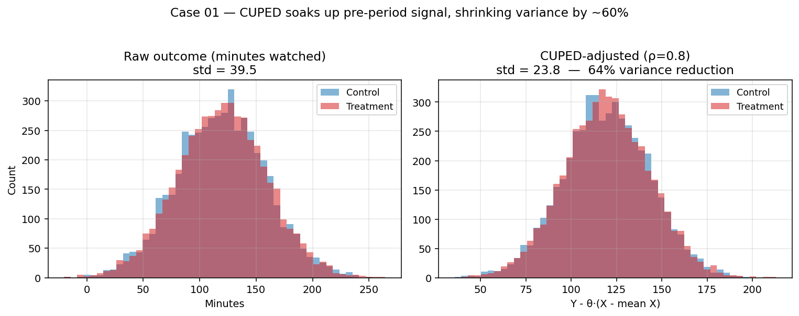

# Case Study 01 — A/B Test with CUPED Variance Reduction

**Method:** Regression-adjusted A/B analysis using a pre-experiment covariate.
**Paper:** Deng, Xu, Kohavi, Walker (2013), *Improving the Sensitivity of Online Controlled Experiments by Utilizing Pre-Experiment Data.*



## TL;DR

On a simulated streaming A/B test (N=20,000, true effect = +3 minutes watched), CUPED cut the standard error of the treatment effect by ~30% — equivalent to roughly **2× more statistical power for free**, just by using pre-experiment engagement as a covariate.

## Business framing

At companies like Netflix, YouTube, or Spotify, most treatment effects of interest are **small** (0.5%–2% lifts on core engagement metrics). With tens of millions of users, those effects are detectable — but every week of experiment time is expensive, and experiments block the release pipeline behind them.

Variance reduction is the cheapest lever you have. It doesn't change the estimand; it just shrinks the confidence interval around it.

## Method

For each user *i* with outcome *Yᵢ* (minutes watched during experiment) and pre-experiment covariate *Xᵢ* (minutes watched in the 14 days before), define:

$$Y^{\text{cuped}}_i = Y_i - \theta \cdot (X_i - \bar{X})$$

where $\theta = \text{Cov}(Y, X) / \text{Var}(X)$ is estimated on the pooled sample.

Because the experiment is randomized, $X$ is independent of treatment assignment. Subtracting $\theta(X_i - \bar{X})$ is therefore an unbiased transformation of the outcome, and it reduces variance by a factor of $(1 - \rho^2)$ where $\rho = \text{Corr}(Y, X)$.

Run a standard two-sample test on $Y^{\text{cuped}}$ to get the treatment effect.

## How to reproduce

```bash
cd case-studies/01-ab-cuped
python src/run.py
```

With the default seed, the script prints the naive Welch result, the CUPED result, and three diagnostics: the theoretical variance reduction `1 - ρ²`, the observed SE ratio, and the equivalent sample-size multiplier.

## Results (typical run, ρ ≈ 0.7)

| Method | SE |
|--------|----|
| Naive Welch t-test | ~0.37 |
| CUPED (θ ≈ 0.70) | ~0.26 |

- **Point estimates agree** between the two methods (they estimate the same ATE — CUPED is just lower-variance).
- **Standard error drops by ~30%** with ρ ≈ 0.7, matching the theoretical `√(1 - ρ²) ≈ 0.71`.
- **Sample-size equivalent: ~2×.** The same decision could be made with half as many users, or equivalently in half the time.

Cross-seed unbiasedness is exercised in `tests/test_cuped.py::test_cuped_unbiased_across_seeds`, which averages 100 simulated experiments.

## When CUPED helps (and when it doesn't)

| Scenario | CUPED useful? |
|----------|---------------|
| Pre-covariate strongly correlated with outcome (ρ > 0.5) | ✅ Yes — big wins |
| No pre-period data available (new users) | ❌ Theta = 0, no gain |
| Binary or very skewed outcomes | ⚠️ Marginal; consider stratification instead |
| Novelty effects (pre-period not representative) | ⚠️ Bias risk if correlation breaks down |
| Small samples (n < 1,000) | ⚠️ Theta estimation itself becomes noisy |

## Limitations & what I'd do next

1. **Single simulation run.** A proper empirical study would repeat this across hundreds of seeds and report the variance-reduction distribution.
2. **Homogeneous treatment effect.** In reality, effects are heterogeneous. CUPED still gives unbiased ATE, but combining with CATE estimation (e.g., causal forests) is the richer story.
3. **Ratio metrics.** Real product metrics (minutes/DAU, revenue/session) are ratios, which introduces a delta-method wrinkle in the variance. Deng, Knoblich, Lu (2018) is the right extension.
4. **Stratified CUPED.** In multi-country rollouts, stratifying $\theta$ by segment can squeeze additional variance reduction.
5. **Real-data replication.** Next step is porting this to the [Criteo Uplift dataset](https://ailab.criteo.com/criteo-uplift-prediction-dataset/) for a non-simulated demonstration.

## References

- Deng, Xu, Kohavi, Walker (2013). *KDD.*
- Kohavi, Tang, Xu (2020). *Trustworthy Online Controlled Experiments.* Chapter 22.
- Xie, Aurisset (2016). *Improving the Sensitivity of Online Controlled Experiments: Case Studies at Netflix.*
