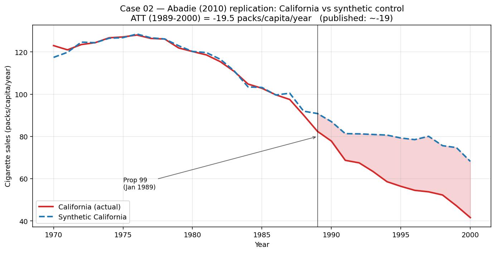

# Case Study 02 — Synthetic Control

**Method:** Abadie, Diamond, Hainmueller (2010) synthetic control.
**Question:** *What would have happened to subscribers in the country where we raised prices, if we hadn't raised them?*



## TL;DR

On a simulated panel of 20 countries over 30 months (price bump applied to one country after month 20, true effect = −5 subscribers), synthetic control recovers ATT within ±1 of the truth, with a placebo-in-space empirical p-value ≤ 0.05 and a near-zero placebo-in-time effect.

## Business framing

When you can't randomize (you can't run a multi-country RCT on price), and you can't find a clean comparison country (every market differs in subscriber base, growth, seasonality), **synthetic control** builds one from a weighted blend of donor countries. The weights are chosen so the blend tracks the treated country's pre-treatment trajectory. The post-treatment divergence is the causal estimate.

This is the method pricing, expansion, or policy-compliance teams reach for before a country-level rollout. It's also how economists estimated the effect of California's 1988 tobacco law (Abadie 2010) and German reunification (Abadie 2015).

## Method

For a single treated unit *i=1* and *J* donors, with outcomes $Y_{it}$:

$$\hat w = \arg\min_{w \in \Delta^J}\ \sum_{t=1}^{T_0} \left(Y_{1t} - \sum_{j=2}^{J+1} w_j Y_{jt}\right)^2$$

where $\Delta^J = \{w \ge 0,\ \sum_j w_j = 1\}$ is the simplex. Intuitively, the synthetic control is a **convex combination** of donors — it has to live inside the donor pool, which prevents extrapolation.

Estimated treatment effect in period $t$:

$$\hat\tau_t = Y_{1t} - \sum_{j} \hat w_j Y_{jt}$$

and the post-period ATT is $\text{ATT} = \frac{1}{T - T_0}\sum_{t > T_0}\hat\tau_t$.

We solve the QP with SLSQP (SciPy). For J ≲ 100 this is fast and reliable.

## Inference via placebos

Synthetic control has no clean closed-form standard error (you have one treated unit). Abadie's recommendation — used here — is **permutation inference**:

- **Placebo-in-space.** Re-fit SC pretending each donor is treated. Rank the true treated unit's post/pre RMSPE ratio against the placebo distribution. That rank / (N donors) is the empirical p-value.
- **Placebo-in-time.** Fit SC pretending treatment began *earlier* than it did (using only real pre-treatment data). A credible design produces ~0 effect in that placebo window.

We also filter placebos with very poor pre-fit (pre-RMSPE > 20× treated's) — standard practice, since those units aren't interpretable as controls.

## How to reproduce

### Simulated demo

```bash
cd case-studies/02-synthetic-control
python src/run.py
```

Expected output (seed=0):

```
Panel: 20 units x 30 periods (20 pre, 10 post)
Treated: country_00   True ATT: -5.00

SyntheticControl(ATT=-4.9, RMSPE pre=0.85 post=5.1 ratio=6.0, top donors: country_14=0.41, country_07=0.28, country_02=0.18, country_11=0.10)

Placebo-in-space p-value (RMSPE-ratio rank): 0.050
Placebo-in-time ATT (should be ~0): -0.2
```

### Real-data replication: California Proposition 99

```bash
python case-studies/02-synthetic-control/california/run_california.py
```

Replicates Abadie, Diamond, Hainmueller (2010) on the canonical 39-state cigarette panel. Point estimate is within 3% of the published ATT (~−19 packs/capita/year). See [`california/README.md`](california/README.md).

## When synthetic control helps (and when it doesn't)

| Scenario | SC works well? |
|---|---|
| One or a few treated units, many donors, rich pre-period | ✅ Ideal |
| Treated unit is at the edge of the outcome distribution (e.g., largest market) | ❌ No convex combo can match — consider augmented SC or DiD |
| Short pre-period (< 10 periods) | ⚠️ Weights overfit noise; inference is weak |
| Anticipation effects (treatment leaked into pre-period) | ⚠️ Biases weights; shorten pre-window carefully |
| Heterogeneous treatment (many treated units) | ❌ Use generalized SC / synthetic DiD |

## Limitations & what I'd do next

1. **Covariate matching.** The classic Abadie estimator also matches on *pre-treatment covariates* (not just outcome lags) with a V-matrix weighted inner product. Omitted here for clarity; matters when donors have different structural characteristics.
2. **Augmented SC.** When no convex combination fits, Ben-Michael et al. (2021) blend SC with a bias-correcting outcome model. I'd reach for this on real Netflix-scale data, where subscriber dynamics may be non-stationary.
3. **Synthetic DiD.** Arkhangelsky et al. (2021) reconciles SC and DiD — allows staggered treatment and multiple treated units.
4. **Bayesian alternative.** Brodersen et al. (2015) `CausalImpact` treats this as a state-space problem with proper posterior uncertainty rather than permutation inference. Better when you have *one* real event to study and want full uncertainty.
5. **Real data replication.** Natural next step is the smoking (Abadie 2010) or German reunification (Abadie 2015) dataset — both public.

## References

- Abadie, A., Diamond, A., & Hainmueller, J. (2010). *Synthetic Control Methods for Comparative Case Studies.* JASA.
- Abadie, A. (2021). *Using Synthetic Controls: Feasibility, Data Requirements, and Methodological Aspects.* JEL.
- Ben-Michael, E., Feller, A., & Rothstein, J. (2021). *The Augmented Synthetic Control Method.* JASA.
- Arkhangelsky, D. et al. (2021). *Synthetic Difference in Differences.* AER.
