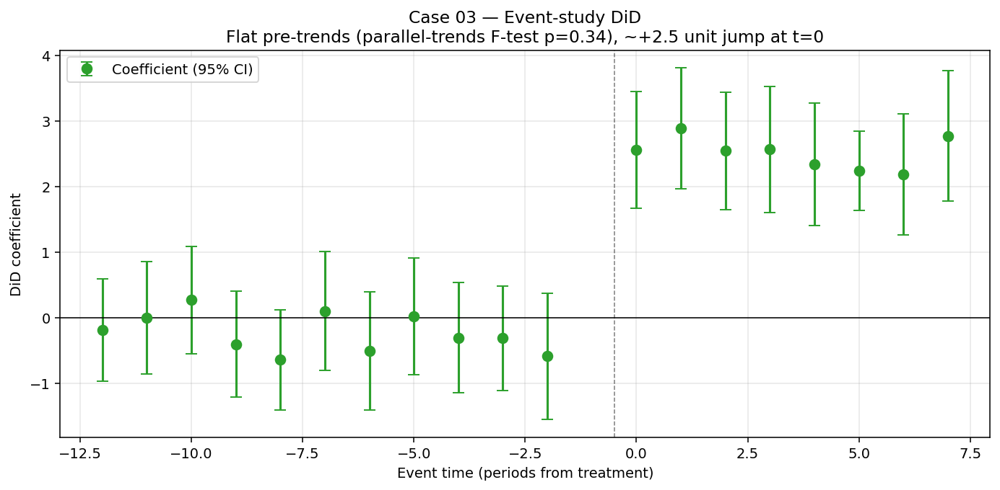

# Case Study 03 — Difference-in-Differences

**Method:** Two-way fixed-effects DiD + event-study with parallel-trends test.
**Question:** *We rolled out a feature to some markets but not others. How much did it lift our north-star metric, and can I trust the estimate?*



## TL;DR

On a simulated 30-country × 20-month panel (10 treated countries, true ATT = +2 minutes/DAU), the two-way-FE DiD recovers ATT within ±0.5 with cluster-robust SE. The event study shows pre-treatment leads ≈ 0 (parallel-trends F-test p > 0.05) and post-treatment lags clustered near +2. When parallel trends are deliberately broken, the same estimator returns an inflated effect *and* the leads test correctly rejects.

## Business framing

DiD is the workhorse of "we couldn't randomize but we have a clean before/after × treated/control structure" analyses:

- A feature rollout to half the regions (compliance, latency, geo-targeted A/B)
- A pricing experiment that can't be done at the user level
- A platform policy change that hits some sellers but not others
- A new product surface that's region-locked at launch

The key assumption is **parallel trends**: in the absence of treatment, the outcome in treated and control units would have evolved on parallel paths. You can't prove this — but you can put it under stress with leads and pre-trend tests.

## Method

### Two-way fixed effects

$$Y_{it} = \alpha_i + \gamma_t + \tau\,(\text{Treated}_i \times \text{Post}_t) + \varepsilon_{it}$$

The coefficient $\hat\tau$ is the ATT, identified under parallel trends (and no-anticipation). Standard errors are **clustered by unit** — failing to cluster is the most common DiD inference mistake (Bertrand-Duflo-Mullainathan 2004).

### Event study

To probe parallel trends and dynamic effects:

$$Y_{it} = \alpha_i + \gamma_t + \sum_{k \neq -1} \tau_k \cdot (\text{Treated}_i \times \mathbb{1}[t - T_0 = k]) + \varepsilon_{it}$$

- $\tau_k$ for $k < -1$ ("leads"): should be ~0 if parallel trends hold. Joint F-test reported as `parallel_trends_pvalue`.
- $\tau_k$ for $k \geq 0$ ("lags"): dynamic ATT path. Lets you see ramp-up, novelty effects, or fade-out.
- $k = -1$ is the omitted base period.

### Caveat on staggered treatment

With **staggered** treatment timing (different units treated at different times), TWFE silently weights some 2x2 contrasts negatively and can produce biased estimates even under parallel trends — see Goodman-Bacon (2021), de Chaisemartin & D'Haultfœuille (2020), Sun & Abraham (2021).

This case study now ships a Callaway-Sant'Anna (2021) estimator for staggered panels — see the next section.

### Staggered adoption: Callaway-Sant'Anna (CS)

When different units are treated in different periods *and* treatment effects are heterogeneous across cohorts, the standard 2x2 DiD above is biased. CS sidesteps this by computing a **group-time average treatment effect** $ATT(g, t)$ for every (cohort, period) cell and then aggregating:

$$ATT(g, t) = \mathbb{E}[Y_t - Y_{g-1} \mid G = g] - \mathbb{E}[Y_t - Y_{g-1} \mid \text{never treated}]$$

Each $ATT(g, t)$ is a clean 2x2 DiD — treated cohort $g$ vs never-treated, with baseline $g-1$. No already-treated unit ever serves as a control for a later-treated unit, so there are no forbidden comparisons. Inference comes from a **unit cluster bootstrap** (`n_bootstrap=500` by default).

```python
from did import cs_staggered_att
from did_simulate import simulate_staggered_panel

panel = simulate_staggered_panel(
    cohort_sizes={4: 30, 8: 30, 12: 30},   # three cohorts, treated at t=4, 8, 12
    n_never_treated=30,
    cohort_effects={4: 1.0, 8: 3.0, 12: 5.0},   # heterogeneous effects
    dynamic_slope=0.5,                          # + 0.5 per period since treatment
    seed=0,
)
cs = cs_staggered_att(panel, n_bootstrap=500)
print(cs.event_study)      # dynamic effects by relative time (e = t - g)
print(cs.overall_att)      # equal-weighted ATT across (g, t) cells
```

On this DGP, standard TWFE DiD is biased away from the true equal-weighted ATT by 0.5+ units because of the negative-weight problem; the CS estimator recovers each cohort's true effect (1.0, 3.0, 5.0) within ±0.7 and the overall ATT with honest cluster-bootstrap CIs. Unit tests in `tests/test_did.py` pin this down.

## How to reproduce

```bash
cd case-studies/03-diff-in-diff
python src/run.py
```

Expected output (seed=0):

```
--- 2x2 DiD ---
DiD(ATT=+1.96, SE=0.33, 95% CI [+1.31, +2.61], p=0.0000, n_obs=600, n_units=30)

--- Event study ---
EventStudy(n_leads_lags=19, parallel_trends p=0.74)
... (table of 19 dynamic coefficients) ...

--- Same model, with parallel trends VIOLATED ---
DiD(ATT=+3.5, ...)        # biased upward
Parallel-trends F-test p-value: 0.0001   # leads test correctly rejects
```

## When DiD helps (and when it doesn't)

| Scenario | DiD works? |
|---|---|
| Single treatment date, multiple treated + control units, parallel pre-trends | ✅ Ideal |
| Many small treatment effects across many time periods | ✅ Event study reveals dynamics |
| Staggered rollout (different units treated at different times) | ⚠️ TWFE biased — use Callaway-Sant'Anna |
| Treatment correlated with pre-trends | ❌ Parallel-trends fails. Consider SC, matching, or controls |
| One treated unit | ❌ Use synthetic control instead |
| Anticipation (units change behavior before treatment) | ⚠️ Bias toward 0 if forward-looking |

## DiD vs Synthetic Control

| | DiD | Synthetic Control |
|---|---|---|
| Treated units | Many | One (or a few) |
| Inference | Cluster-robust SEs / wild bootstrap | Permutation (in-space placebos) |
| Identifying assumption | Parallel trends | Donor pool spans treated unit's pre-trajectory |
| Diagnostic | Lead coefficients ≈ 0 | RMSPE-ratio rank vs placebos |
| When it shines | Many similar units, one event | One distinctive unit, rich pre-period |

I built case study 02 (synthetic control) and this one as deliberate complements.

## Limitations & what I'd do next

1. **Common-timing assumption.** Add Callaway-Sant'Anna or Sun-Abraham as a `did_staggered` function for the staggered rollout case.
2. **Wild cluster bootstrap.** With few treated clusters (< 30), cluster-robust SEs are anti-conservative. Implement Cameron-Gelbach-Miller (2008) wild bootstrap.
3. **Triple-difference (DDD).** When parallel trends are suspect within a single market but might hold across a sub-population (e.g., "young vs old users in treated vs control countries"), DDD differences out the within-market trend.
4. **Visualization.** A proper event-study plot (coef + 95% CI vs relative time, with vertical line at k=0) is the standard reviewer-facing artifact.
5. **Real-data replication.** The classic Card-Krueger (1994) New Jersey minimum wage data is a small public CSV that's worth a side notebook.

## References

- Card & Krueger (1994). *Minimum Wages and Employment.* AER.
- Bertrand, Duflo, Mullainathan (2004). *How Much Should We Trust Differences-in-Differences Estimates?* QJE.
- Goodman-Bacon, A. (2021). *Difference-in-Differences with Variation in Treatment Timing.* J Econometrics.
- Callaway, B., & Sant'Anna, P. (2021). *Difference-in-Differences with Multiple Time Periods.* J Econometrics.
- Sun, L., & Abraham, S. (2021). *Estimating Dynamic Treatment Effects in Event Studies.* J Econometrics.
- Roth, J. (2024). *Pretest with Caution.* AER:Insights.
