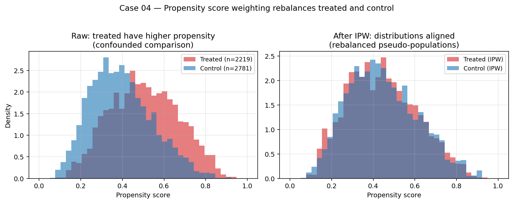

# Case Study 04 — Propensity Score Matching

**Method:** 1-NN propensity score matching with caliper, IPW, and AIPW (doubly-robust).
**Question:** *We can't randomize who installs the mobile app. Did app installation actually drive higher spend, or are app installers just inherently more engaged users?*



## TL;DR

On 5,000 simulated e-commerce users where the true effect of app install is +$50 in annual spend, the **naive comparison** of installers vs non-installers reads ≈ +$95 — almost 2× too high — because installers are already heavier, premium, younger users. PSM, IPW, and AIPW all recover ATT within ±$5 of the truth and reduce average covariate imbalance (|SMD|) from ~0.5 to <0.1.

## Business framing

Most "did feature X cause outcome Y?" questions at FAANG analytics aren't experiments. They're observational:

- *Did users who joined community feature retain better?* (community joiners self-select)
- *Did sellers who used the new dashboard ship faster?* (proactive sellers self-select)
- *Did Premium subscribers watch more after the algorithm change?* (Premium status is endogenous)

The naive answer is almost always wrong. Propensity methods give you a defensible, transparent way to adjust for **observed** confounders — and a principled way to argue about which unobserved ones could plausibly overturn the result (sensitivity analysis).

What they cannot do: fix unobserved confounding. If something we didn't measure drives both treatment and outcome, no amount of weighting or matching will save us.

## Method

### Identifying assumption: conditional unconfoundedness

$$(Y(0), Y(1)) \perp T \mid X$$

i.e., conditional on observed covariates, treatment is as good as random.

Combined with **overlap** (0 < e(x) < 1 everywhere), this lets us identify ATE/ATT.

### 1. Propensity score

$$e(x) = P(T=1 \mid X=x)$$

Estimated via logistic regression (could be ML — gradient boosting, etc., but linear logistic is interpretable and well-calibrated for ATE/ATT under correct specification).

### 2. Matching

For each treated unit, find its nearest control on the **logit propensity** (not raw e — logit is symmetric and has constant variance). Apply a **caliper** of 0.2 × SD(logit e) (Rosenbaum-Rubin convention) — drop treated units that have no control within caliper distance.

ATT = mean of (Y_treated - Y_matched_control) across pairs.

### 3. IPW

$$\hat{\text{ATT}}_{IPW} = \frac{1}{n_t} \sum_i \left[ T_i Y_i - (1 - T_i) \frac{e(X_i)}{1 - e(X_i)} Y_i \right]$$

### 4. AIPW (doubly robust)

$$\hat{\text{ATT}}_{AIPW} = \frac{1}{n_t} \sum_i \left[ T_i (Y_i - \hat\mu_0(X_i)) - (1 - T_i) \frac{e(X_i)}{1 - e(X_i)} (Y_i - \hat\mu_0(X_i)) \right]$$

Consistent if **either** the propensity model or the outcome model $\hat\mu_0$ is correct. This is the modern default — a small free hedge against misspecification.

### 5. Sensitivity to unmeasured confounding

Everything above assumes **conditional unconfoundedness**: no unobserved variable affects both treatment and outcome. That assumption is untestable from the data, so serious observational work also reports how fragile the conclusion would be under violation.

This case study ships two complementary sensitivity tools in `src/sensitivity.py`:

**E-value (VanderWeele & Ding, 2017).** The minimum strength of association, on the risk-ratio scale, that an unmeasured confounder $U$ would need with both $T$ and $Y$ (conditional on $X$) to *fully* explain away the effect:

$$E = RR + \sqrt{RR(RR-1)}$$

For continuous outcomes we use Chinn's approximation $RR \approx \exp(0.91 \cdot d)$ where $d$ = ATT / SD(Y).
E-values are reported for both the point estimate and the CI bound nearest the null (following VanderWeele-Ding's guidance).

**Rosenbaum bounds (Rosenbaum, 2002).** For 1-to-1 matched pairs, the sensitivity parameter $\Gamma$ bounds the odds that two matched units with the same $X$ could nevertheless have differential treatment probabilities (because of hidden confounder $U$). We sweep $\Gamma \ge 1$ and report the worst-case one-sided Wilcoxon signed-rank p-value at each level, then solve for the threshold $\Gamma^\star$ at which the result becomes non-significant at $\alpha=0.05$.

```python
from sensitivity import (
    e_value,
    matched_pair_differences,
    rosenbaum_gamma_threshold,
    rosenbaum_wilcoxon_bounds,
)

diffs = matched_pair_differences(X, T, Y, caliper_sd=0.2)
att = diffs.mean()
sd_y = Y[T == 0].std(ddof=1)

ev = e_value(att, sd_outcome=sd_y, ci_low=ci_low, ci_high=ci_high)
# -> EValue(RR=..., point=..., CI=..., scale=continuous ...)

g_star = rosenbaum_gamma_threshold(diffs, alpha=0.05, alternative="greater")
bounds = rosenbaum_wilcoxon_bounds(diffs, gammas=[1.0, 1.25, 1.5, 2.0, 3.0])
```

Reporting pattern to hand a PM or legal reviewer: *"The matched ATT is +\$50 (95% CI [\$30, \$70]). The E-value of 2.1 on the CI means an unmeasured confounder would need 2.1-fold associations with both install decision and spend to explain the finding. The matched pairs survive Rosenbaum sensitivity up to $\Gamma^\star = 1.9$ — i.e., hidden confounders could almost double the within-pair odds of installation before we'd fail to detect a positive effect."*

## How to reproduce

```bash
cd case-studies/04-propensity-score
python src/run.py                 # simulated panel — recovers +$50 ATT
python lalonde/run_lalonde.py     # real-data LaLonde 1986 replication
```

### Simulated run (seed=0)

```
Sample: n=5,000  treated=2,800  true ATT=+50.0

Naive (treated - control)        : +95.4   (biased)
psm_1nn(ATT=+49.8, SE=2.0, 95% CI [+45.9, +53.7], matched=2780/2800, caliper_drops=20)
IPW ATT                          : +50.4
AIPW (doubly-robust) ATT         : +50.1

Covariate balance:
        covariate  smd_unmatched  smd_matched
              age          -0.42         0.01
     prior_orders           0.61         0.02
   premium_member           0.71         0.00
     region_score           0.21         0.01
days_since_signup           0.05         0.01
```

### Real-data replication — LaLonde (1986)

See [`lalonde/`](lalonde/) for the canonical observational-causal benchmark:
the NSW job-training experiment + Dehejia-Wahba CPS controls. Validates that
the estimators recover the experimental ATT (~$1,794) on real data where the
naive estimator is catastrophically wrong (~−$8,500).

## When PSM/IPW/AIPW help (and when they don't)

| Scenario | Works? |
|---|---|
| All confounders measured; rich X | ✅ |
| Strong overlap (treated and control e-distributions overlap) | ✅ |
| Limited overlap (some treated units have no comparable controls) | ⚠️ Caliper drops them; ATT becomes restricted ATT |
| Unobserved confounder of treatment AND outcome | ❌ Will not save you. Use IV or sensitivity analysis (Rosenbaum bounds, E-value) |
| High-dim X (p > n) | ⚠️ Use ML for propensity (TMLE, double ML) |
| Heterogeneous effects | ⚠️ ATE != ATT; consider CATE estimation (causal forests) |

## Limitations & what I'd do next

1. **Sensitivity analysis.** A causal claim from observational data isn't complete without a Rosenbaum-bounds or E-value calculation: how strong would unobserved confounding need to be to flip the conclusion?
2. **Double ML / TMLE.** Use cross-fitted gradient boosting for both propensity and outcome models (Chernozhukov et al. 2018). Better small-sample properties than naive AIPW.
3. **Variable-ratio matching.** 1-NN is wasteful when controls are abundant. k-NN or full matching uses more controls per treated unit.
4. **Genetic matching / Mahalanobis matching** for guarantees on covariate balance regardless of propensity model.
5. **Real-data replication.** [LaLonde 1986](https://users.nber.org/~rdehejia/data/.nswdata2.html) job training data is the canonical PSM benchmark — testing here would be honest.

## References

- Rosenbaum, P., & Rubin, D. (1983). *The Central Role of the Propensity Score in Observational Studies.* Biometrika.
- Hirano, K., Imbens, G., & Ridder, G. (2003). *Efficient Estimation of Average Treatment Effects Using the Estimated Propensity Score.* Econometrica.
- Abadie, A., & Imbens, G. (2008). *On the Failure of the Bootstrap for Matching Estimators.* Econometrica.
- Stuart, E. (2010). *Matching Methods for Causal Inference: A Review.* Statistical Science.
- Chernozhukov, V. et al. (2018). *Double/Debiased Machine Learning.* Econometrics Journal.
- VanderWeele, T., & Ding, P. (2017). *Sensitivity Analysis in Observational Research: Introducing the E-value.* Annals of Internal Medicine.
