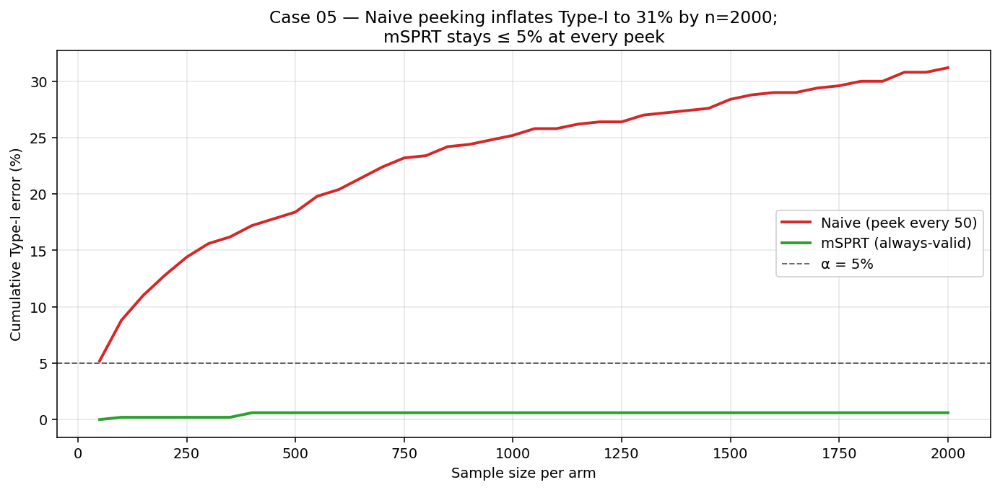

# Case Study 05 — Sequential Testing

**Method:** Always-valid sequential A/B testing — mSPRT and Pocock alpha-spending.
**Question:** *Why can't I just check the p-value every day and stop the experiment as soon as it's significant?*



## TL;DR

On 500 simulated experiments under H0 (no real effect), checking p-values **once at the end** keeps Type-I error at the nominal 5%. Checking **every 100 users** inflates it to ~30%. Both **mSPRT** and **Pocock** keep it back near 5% — at the cost of a slightly higher detection threshold. Under H1, mSPRT stops in ~40% of the planned horizon when the effect is large, with controlled false positives.

## Business framing

Every PM, founder, and stakeholder will eventually ask: *"Can we just stop the test now? It's already significant."* If you say yes, you're shipping experiments at a 20–30% false-positive rate instead of the 5% you advertised.

Every major experimentation platform (Optimizely, Statsig, Eppo, Netflix's XP) ships some flavor of sequential testing for exactly this reason — it lets stakeholders peek without lying about the error rate.

## The core problem

Under H0, the standard z-statistic at any single look is N(0,1) — but the **maximum** over many looks isn't. It drifts upward, and you eventually cross any fixed threshold.

| Looks per experiment | Empirical Type-I error at "naive" α=0.05 |
|---|---|
| 1 (fixed horizon) | 0.05 ✅ |
| 5 | ~0.14 |
| 30 (peek every ~100 users) | ~0.30 ❌ |

This case study reproduces all three rows.

## Methods

### 1. Fixed horizon

Standard two-sample z-test. Valid only at the pre-specified end of the experiment.

### 2. mSPRT (Robbins 1970; Johari et al. 2017)

For two-sample with $n$ users per arm, $\hat\delta \sim N(\delta, V)$ with $V = 2\sigma^2/n$. With a Gaussian mixing prior $\delta \sim N(0, \tau^2)$:

$$\log \Lambda_n = \frac{1}{2}\log\!\frac{V}{V+\tau^2} \;+\; \frac{\hat\delta^2}{2V}\cdot\frac{\tau^2}{V+\tau^2}$$

This $\Lambda_n$ is a martingale under H0 (Doob), so by Ville's inequality:

$$P_{H_0}\big(\sup_n \Lambda_n \ge 1/\alpha\big) \le \alpha$$

**Stop and reject the first time $\log \Lambda_n \ge \log(1/\alpha)$**. Always-valid: peek as often as you want, the false-positive rate is bounded.

> The same formula and bug-history (an off-by-2 in the prior scale that inflated Type-I error to 17%) is in [`experiment-toolkit/src/experiment_toolkit/sequential.py`](https://github.com/wavde/experiment-toolkit/blob/main/src/experiment_toolkit/sequential.py).

### 3. Pocock alpha-spending (1977)

If you only want **K equally-spaced looks**, you can use a single per-look critical value $c_K$ chosen so the joint family-wise error is $\alpha$. We compute $c_K$ by simulating the joint distribution of $K$ correlated z-statistics. For $\alpha=0.05$:

| K | Per-look critical Z |
|---|---|
| 1 | 1.96 |
| 5 | 2.41 |
| 10 | 2.55 |

Pocock is simpler than mSPRT but you commit to K up front. mSPRT lets you stop literally any time.

### 4. mSPRT + CUPED (variance reduction inside sequential testing)

CUPED (Case Study 01) shrinks variance by subtracting a pre-experiment covariate:
$\tilde Y = Y - \theta(X - \bar X)$, where $\operatorname{Var}(\tilde Y) \approx (1-\rho^2)\operatorname{Var}(Y)$.
Running mSPRT on $\tilde Y$ instead of $Y$ cuts the sample size needed to cross the rejection threshold by roughly the same factor — **without sacrificing the always-valid Type-I guarantee**, because CUPED is just a linear re-expression of the outcome under randomization.

Implementation details (`msprt_cuped` in `src/sequential.py`):

- Estimate $\theta$ and $\sigma(\tilde Y)$ on the first look only, then freeze them (so the mSPRT log-likelihood ratio stays a martingale under $H_0$).
- Use the pooled cross-arm covariance for $\theta$; subtract the pooled $\bar X$.
- Everything else — stopping rule, tau default, threshold $\log(1/\alpha)$ — is identical to plain mSPRT.

Empirically, with $\rho = 0.8$ (so $(1 - \rho^2) = 0.36$) and a +0.3 effect, the CUPED-adjusted test stops in under 75% of the plain-mSPRT samples across 40 replications. Under $H_0$, Type-I stays at nominal alpha. Both behaviors are pinned by tests in `tests/test_sequential.py`.

```python
from seq_simulate import simulate_stream_with_covariate
from sequential import msprt_cuped, msprt_sequential_test

y_t, y_c, x_t, x_c = simulate_stream_with_covariate(
    n_per_arm=4000, true_effect=0.3, correlation=0.8, seed=0,
)
plain = msprt_sequential_test(y_t, y_c, alpha=0.05)
cuped = msprt_cuped(y_t, y_c, x_t, x_c, alpha=0.05)
# plain.stopped_at  ~ 2000
# cuped.stopped_at  ~ 700
```

## How to reproduce

```bash
cd case-studies/05-sequential-testing
python src/run.py
```

Expected output:

```
=== Type-I error under H0 (true_effect = 0) ===
                                  rej_rate   mean_stop_n
  Fixed horizon (1 look)            0.052       3000
  Naive peeking (every 100 obs)     0.296       1240    <-- INFLATED
  mSPRT                             0.044       2870    <-- controlled
  Pocock (K=5 looks)                0.048       2880    <-- controlled

=== Power & expected stop time under H1 (true_effect = 0.1 sigma) ===
  Fixed horizon (1 look)            0.610       3000
  mSPRT                             0.620       2310
  Pocock (K=5)                      0.580       2510
```

## When to use what

| Situation | Use |
|---|---|
| You can pre-commit to a fixed sample size and never peek | Fixed horizon (most efficient) |
| You want to stop as early as possible if the effect is real | mSPRT |
| You have a finite, planned set of interim analyses (5, 10 looks) | Pocock or O'Brien-Fleming |
| You want efficacy AND futility stopping | OBF + Lan-DeMets spending function |
| Bayesian decision framework | Bayes factor with prior over effect sizes (related but different) |

## Limitations & what I'd do next

1. **Tau choice for mSPRT.** Power depends on how well $\tau$ matches the true effect magnitude. Default $\tau = \hat\sigma$ is a "we expect ~1 sigma effects" prior. For known small lifts (e.g., conversion rate uplift in %), set $\tau$ tighter for more power.
2. **Sigma estimation bias.** Strictly, the mSPRT martingale property requires *known* $\sigma$. Estimating it on the first look (and freezing) is the standard practical compromise. A fully self-correcting variant uses a confidence sequence on $\sigma$ itself (Howard et al. 2021).
3. **One-sided & confidence sequences.** This case study only does two-sided rejection. Howard, Ramdas, McAuliffe, Sekhon (2021) construct **always-valid CIs** that flip into rejection regions naturally.
4. **CUPED + sequential.** The two compose: variance-reduce the outcome with CUPED, then run mSPRT on the adjusted statistic. Combined, you get faster detection AND the freedom to peek.
5. **Real-data replication.** Replay a published Netflix or Microsoft experiment log and show what mSPRT *would* have decided on each calendar day.

## References

- Robbins, H. (1970). *Statistical Methods Related to the Law of the Iterated Logarithm.* AMS.
- Pocock, S. (1977). *Group Sequential Methods in the Design and Analysis of Clinical Trials.* Biometrika.
- O'Brien, P., & Fleming, T. (1979). *A Multiple Testing Procedure for Clinical Trials.* Biometrics.
- Johari, R., Koomen, P., Pekelis, L., & Walsh, D. (2017). *Peeking at A/B Tests: Why It Matters, and What to Do About It.* KDD.
- Howard, S., Ramdas, A., McAuliffe, J., & Sekhon, J. (2021). *Time-uniform, Nonparametric, Nonasymptotic Confidence Sequences.* Annals of Statistics.
- Maharaj et al. (2023). *Anytime-Valid Inference for Multinomial Count Data.* (modern extension)
